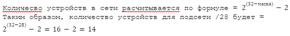
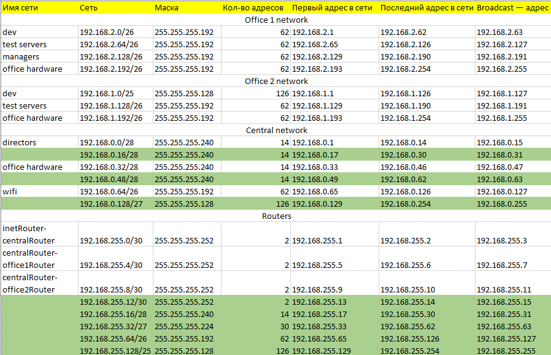
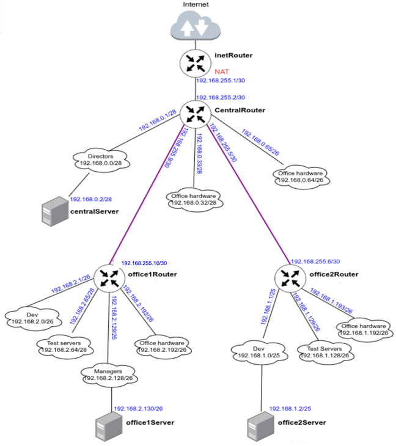

<h2># Теоретическая часть</h2>
<h3>- Найти свободные подсети</h3>
сеть имеет следующую архитектуру<br>
Сеть office1<br>
192.168.2.0/26 - dev<br>
192.168.2.64/26 - test servers<br>
192.168.2.128/26 - managers<br>
192.168.2.192/26 - office hardware<br>
Сеть office2<br>
192.168.1.0/25 - dev<br>
192.168.1.128/26 - test servers<br>
192.168.1.192/26 - office hardware<br>
Сеть central<br>
192.168.0.0/28 - directors<br>
192.168.0.32/28 - office hardware<br>
192.168.0.64/26 - wifi<br>
```<br>
Office1 ---\<br>
----> Central --IRouter --> internet<br>
Office2----/<br>
```<br><br>

Ручной расчет для сети directors 192.168.0.0/28<br>
192.168.0.0 — это сама сеть, 28 — это маска. Маска показывает нам, границы сети 192.168.0.0. Маска может быть записана в 2-х видах:<br>
1) /28<br>
2) 255.255.255.240<br><br>

Пример перевода маски /28 в формат 255.255.255.240:<br><br>

Маска Ipv4-адреса — это 4 октета, т.е. 4 блока по 8 цифр (1 или 0). <br>
/28 — это 28 единиц с начала маски: 11111111.11111111.11111111.11110000  <br>
Всегда при разбиении сетей, после знака / указывается количество единиц с начала маски.<br>

11111111.11111111.11111111.11110000 — это двоичный код маски, если мы переведем данное значение в десятичную систему счисления, то получим 255.255.255.240<br>

</img>

Цифра 2 вычитается, так как:<br>
Первый адрес (192.168.0.0) — это наименование подсети, его нельзя задать устройству<br>
Последний адрес (192.168.0.15) — это всегда broadcast-адрес. Broadcast-адрес нужен для рассылки всем устройствам сети. <br><br>

таблица топологии всей сети, полученная при помощи https://ip-calculator.ru/:<br>

Адресов 192.168.255.0 - 192.168.255.11 в изначальном условии задачи не было, как они появились по при поиске свободных подсетей в методичке - непонятно.<br>
Ошибок при разбиении нет.
В таблице посчитаны узлы для каждой подсети. Свободные подсети выделены зеленым цветом ячеек
</img><br>

<h2>Стенд из 7 машин vagrant+ansible:</h2>
</img>
Офисы соединены в сеть согласно схеме и настроен роутинг<br>
Все сервера и роутеры ходят в интернет черз inetRouter<br>
Все сервера видят друг друга<br>
у всех серверов отключен дефолт на нат (eth0), который вагрант поднимает для связи<br><br>
