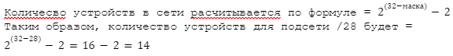

<h3>расчет количества устройств в сети</h3>

<table>
<tr>
      <td>Name</td>
      <td>Network</td>
      <td>Netmask</td>
      <td>N</td>
      <td>Hostmin</td>
      <td>Hostmax</td>
      <td>Broadcast</td>
</tr>
<tr>
      <td colspan="7" align="center"><b>Central Network</b></td>
</tr>
<tr>
      <td>Directors</td>
      <td>192.168.0.0/28</td>
      <td>255.255.255.240</td>
      <td>14</td>
      <td>192.168.0.1</td>
      <td>192.168.0.14</td>
      <td>192.168.0.15</td>
</tr>
<tr>
      <td>Office hardware</td>
      <td>192.168.0.32/28</td>
      <td>255.255.255.240</td>
      <td>14</td>
      <td>192.168.0.33</td>
      <td>192.168.0.46</td>
      <td>192.168.0.47</td>
</tr>
<tr>
      <td>Wifi(mgt network)</td>
      <td>192.168.0.64/26</td>
      <td>255.255.255.192</td>
      <td>62</td>
      <td>192.168.0.65</td>
      <td>192.168.0.126</td>
      <td>192.168.0.127</td>
</tr>
<tr>
      <td colspan="7" align="center"><b>Office 1 network</b></td>
</tr>
<tr>
      <td>Dev</td>
      <td>192.168.2.0/26</td>
      <td>255.255.255.192</td>
      <td>62</td>
      <td>192.168.2.1</td>
      <td>192.168.2.62</td>
      <td>192.168.2.63</td>
</tr>
<tr>
      <td>Test</td>
      <td>192.168.2.64/26</td>
      <td>255.255.255.192</td>
      <td>62</td>
      <td>192.168.2.65</td>
      <td>192.168.2.126</td>
      <td>192.168.2.127</td>
</tr>
<tr>
      <td>Managers</td>
      <td>192.168.2.128/26</td>
      <td>255.255.255.192</td>
      <td>62</td>
      <td>192.168.2.129</td>
      <td>192.168.2.190</td>
      <td>192.168.2.191</td>
</tr>
<tr>
      <td>Office hardware</td>
      <td>192.168.2.192/26</td>
      <td>255.255.255.192</td>
      <td>62</td>
      <td>192.168.2.193</td>
      <td>192.168.2.254</td>
      <td>192.168.2.255</td>
</tr>
<tr>
      <td colspan="7" align="center"><b>Office 2 network</b></td>
</tr>
<tr>
      <td>Dev</td>
      <td>192.168.1.0/25</td>
      <td>255.255.255.128</td>
      <td>126</td>
      <td>192.168.1.1</td>
      <td>192.168.1.126</td>
      <td>192.168.1.127</td>
</tr>
<tr>
      <td>Test</td>
      <td>192.168.1.128/26</td>
      <td>255.255.255.192</td>
      <td>62</td>
      <td>192.168.1.129</td>
      <td>192.168.1.190</td>
      <td>192.168.1.191</td>
</tr>
<tr>
      <td>Office</td>
      <td>192.168.1.192/26</td>
      <td>255.255.255.192</td>
      <td>62</td>
      <td>192.168.1.193</td>
      <td>192.168.1.254</td>
      <td>192.168.1.255</td>
</tr>
<tr>
      <td colspan="7" align="center"><b>InetRouter — CentralRouter network</b></td>
</tr>
<tr>
      <td>Inet — central</td>
      <td>192.168.255.0/30</td>
      <td>255.255.255.252</td>
      <td>2</td>
      <td>192.168.255.1</td>
      <td>192.168.255.2</td>
      <td>192.168.255.3</td>
</tr>

</table>